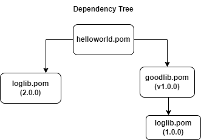
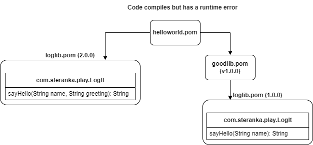
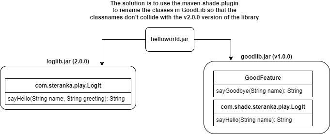

# Overview of the application
This is an example that illustrates the problem that occurs in most large projects and how the 
maven-shade-plugin works to fix the problem.

This code example was developed in order to allow me to understand how the maven-shade-plugin works
with a real code but very simplified.

The idea of the simplicity was inspired by the StackOverflow answer: https://stackoverflow.com/questions/13620281/what-is-the-maven-shade-plugin-used-for-and-why-would-you-want-to-relocate-java/13620420#13620420

which explains why the maven-shade-plugin is needed and the problem it solves.

In this code the following JAR files exist

- helloworld.jar - A Java executable jar that is the main program.

- loglib.jar - There are two versions of this jar file (in different directories).

- goodlib.jar - This is another JAR file that uses version 1 of loglib.jar (dir loglibv1).

## Overview of the Dependency Tree
The following diagram shows the dependency tree for the helloworld application.



Each of the pom files create a JAR file so there are 4 (four) jar files created by this code example. 


## Summary of the Problem
The next diagram shows the loglib.jar file being used in both the main application (helloworld)



It shows the class `LogIt` contains a method `sayHello` which takes one argument *String name* in version 1.0.0 of the package (liblog.jar) 
and `sayHello` takes two arguments in the 2nd version of the package.   

While this example is contrived to demonstrate the general problem
that faces Java developers on more complex code bases, this simplified version of the problem is intended to make the problem
easy to understand and to fix.

So by default, when a FAT jar is created for the **HelloWorld** application, the Fat jar only contains one copy of the class file `com.steranka.play.LogIt`.
The result is that either the `HelloWorld` class will crash or the `GoodFeature` class will crash. *Where crash means throw an exception*
Below is an example of the exception I saw when I first ran the application.
```
java -jar helloworld\target\helloworld-1.0.0.jar
Hello World!
What's up, Sam
Exception in thread "main" java.lang.NoSuchMethodError: 'java.lang.String com.steranka.play.LogIt.sayHello(java.lang.String)'
at com.steranka.play.GoodFeature.sayGoodbye(GoodFeature.java:6)
at com.steranka.play.HelloWorldApp.main(HelloWorldApp.java:15)
```
This problem occurs because version 2.0.0 of the loglib.jar was used which contained the signature:
```
sayHello(String name, String greeting)
```
and the code in `GoodFeature.sayGoodbye` had bytecode which called the version 1.0.0 of the signature which was:
```
sayHello(String name)
```

Since that signature did not exist, the exception occured.

## The Solution

The solution is to include both versions of the `loglib` jar file as shown in the next diagram.


# Next Steps
If you want to follow along with what I did, and learn how I solved this problem
continue [here with cthe doc/01-Starting.md](doc/01-Starting.md) file.