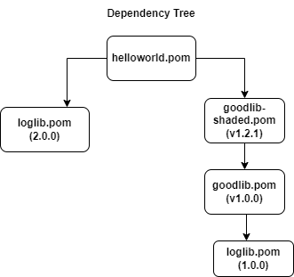

# Fixing the problem using the maven shade plugin (another way)
My first attempt to fix the problem required the original distribution of a package
to shade internally used libraries.  That is not practical.

In this next example, I create a wrapper around the problematic dependency and create a shaded
version of the library.  The following diagram illustrates the dependencies.



So rather than expecting another author to change their package and shade something
that is causing me problems, I fix the problem myself and created a shaded version
of their library (instead of requiring them to do it).

# Getting the code
To continue with this example, you need to run:
```
git checkout feature/fixing-problem-another-way
```

### Building and running the code
To build and run the code use the following
```
mvn clean install
java -jar helloworld\target\helloworld-1.0.0.jar
```
You'll get the desired output without any errors:
```
Hello World!
What's up, Sam
Hello, Sam
Goodbye, Sam
```

# What I did to fix it

I change the original code (in `main` branch) so that `helloworld`  depends on the `goodlib-shaded`
library thereby allowing both versions of the loglib library to exist in the same JAR file.

This code changes the `helloworld/pom.xml` file to depend on `goodlib-shaded:1.2.1`
instead of `goodlib:1.0.0` package.   This branch also creates the package `goodlib-shaded:1.2.1`
and the top level `pom.xml` file is changed to build the goodlib-shaded library along with all
of the other libraries already being built.

The jar files created in this solution are really the same as the one in the previous solution
but in this case, I was able to create a wrapper jar file to shade the package `goodlib.jar`
rather than (in the previous case) asking the author of the `goodlib.jar` library to created a
shaded jar file and distribute it.


## The resulting shaded jar file  
The `jar tvf` command shows that the `Logit` class was shaded.
```shell
jar tf goodlib-shaded\target\goodlib-shaded-1.2.1.jar | sort
com/shaded/steranka/play/LogIt.class  ### NOTICE THIS name shows the LogIt class was shaded
com/steranka/play/GoodFeature.class
```

Below is the list of the classes in the `helloword` jar file:
```shell
jar tf helloworld\target\helloworld-1.0.0.jar
com/steranka/play/HelloWorldApp.class
com/steranka/play/GoodFeature.class
com/shaded/steranka/play/LogIt.class
com/steranka/play/LogIt.class
```
You can see that the `com.shaded.steranka.play.LogiIt` class comes from the v1.0.0 loglib library;
while `com.steranka.play.LogiIt` comes from the loglib:2.0.0 version of the library.

## When to use this approach
This approach can be used when conflicts exist between two packages that you depend on (that are
outside of your control (code base)).

To fix the problem and allow both versions of a library that each packages needs; 
you pick one of the packages and created a *shaded* version of the package and change 
your dependency to use the shaded version.

Click [here to go back to the top README.md](../README.md)
